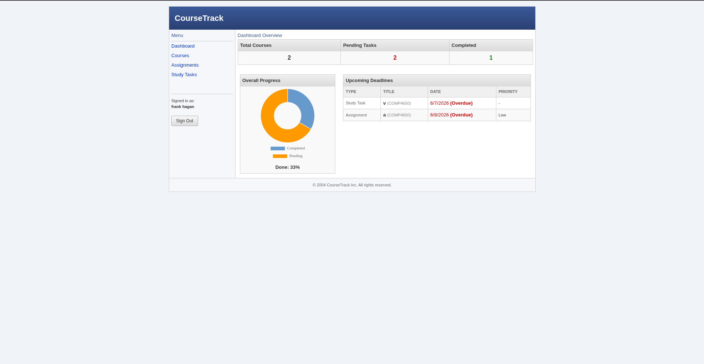
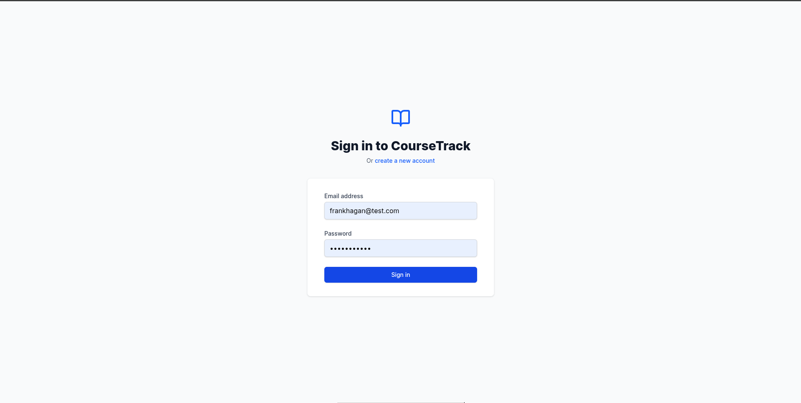
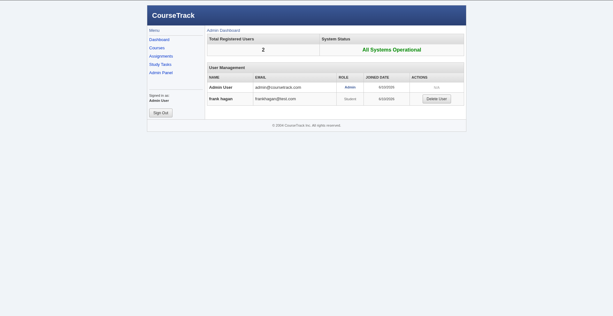

# 2004 Branch of CourseTrack: Student Assignment and Study Planner

CourseTrack is a web-based assignment and study planner that helps students organize courses, deadlines, study tasks, and progress in one dashboard.

## Screenshots

<p float="left">
  
  
</p>


## Table of Contents
1. [Setup Instructions](#setup-instructions)
2. [Software Requirements Specification (SRS)](#software-requirements-specification-srs)
3. [API Route List](#api-route-list)
4. [User Manual](#user-manual)
5. [Admin Guide](#admin-guide)
6. [Testing Checklist](#testing-checklist)

---

## Setup Instructions

### Prerequisites
- Node.js (v14 or higher)
- MongoDB (local or Atlas)

### Backend Setup
1. Navigate to the `backend` folder: `cd backend`
2. Install dependencies: `npm install`
3. Create a `.env` file in the `backend` directory with the following:
   ```env
   PORT=5000
   MONGODB_URI=mongodb://localhost:27017/coursetrack
   JWT_SECRET=your_super_secret_jwt_key
   NODE_ENV=development
   ```
4. Run the seed script to create the default admin user:
   `node seeder.js`
   *(Admin login: admin@coursetrack.com / password123)*
5. Start the backend server: `npm run dev` (if nodemon is set) or `node server.js`

### Frontend Setup
1. Navigate to the `frontend` folder: `cd frontend`
2. Install dependencies: `npm install`
3. Create a `.env` file in the `frontend` directory:
   ```env
   VITE_API_URL=http://localhost:5000/api
   ```
4. Start the frontend server: `npm run dev`

---

## Software Requirements Specification (SRS)

### 1. Introduction
**Purpose:** CourseTrack helps students manage their coursework by tracking assignments, study tasks, and deadlines in a centralized dashboard.
**Scope:** A responsive web application with CRUD operations for courses, assignments, and study tasks, along with user authentication and an admin view. No mobile app, no real-time chat, no payment processing.

### 2. Functional Requirements
- **FR1 (Authentication):** Users shall be able to register, log in, and log out securely.
- **FR2 (Authorization):** Users shall only access and modify their own records.
- **FR3 (Course Management):** Users shall be able to create, read, update, and delete (CRUD) courses.
- **FR4 (Assignment Management):** Users shall be able to CRUD assignments linked to courses with statuses (Pending, In Progress, Completed) and priorities (Low, Medium, High).
- **FR5 (Study Task Management):** Users shall be able to CRUD personal study tasks with durations and completion status.
- **FR6 (Dashboard):** The system shall display a dashboard summarizing upcoming assignments, overdue tasks, and visual progress charts.
- **FR7 (Admin Features):** Admin users shall be able to view user statistics and system-wide data.

### 3. Non-Functional Requirements
- **NFR1 (Performance):** Dashboard shall load in under 2 seconds.
- **NFR2 (Security):** Passwords must be hashed using bcrypt; API endpoints protected via JWT.
- **NFR3 (Usability):** Responsive UI adapting to desktop, tablet, and mobile screens.

---

---

## API Route List

### Auth Routes (`/api/auth`)
- `POST /register` - Register a new user
- `POST /login` - Authenticate a user and get token
- `GET /profile` - Get current user profile (Protected)

### Course Routes (`/api/courses`)
- `GET /` - Get all courses for logged-in user (Protected)
- `POST /` - Create a course (Protected)
- `PUT /:id` - Update a course (Protected)
- `DELETE /:id` - Delete a course (Protected)

### Assignment Routes (`/api/assignments`)
- `GET /` - Get assignments for user (Protected)
- `POST /` - Create assignment (Protected)
- `PUT /:id` - Update assignment (Protected)
- `DELETE /:id` - Delete assignment (Protected)

### Study Task Routes (`/api/studytasks`)
- `GET /` - Get study tasks for user (Protected)
- `POST /` - Create study task (Protected)
- `PUT /:id` - Update study task (Protected)
- `DELETE /:id` - Delete study task (Protected)

### Admin Routes (`/api/admin`)
- `GET /users` - Get list of all users (Protected, Admin only)
- `GET /stats` - Get system statistics (Protected, Admin only)

---

## User Manual

1. **Getting Started:** Navigate to the home page and click "Register". Enter your name, email, and password.
2. **Dashboard:** Upon logging in, you will see your Dashboard. Initially, it will be empty.
3. **Adding Courses:** Go to "Courses" from the navigation menu. Click "Add Course", fill in the course details, and save.
4. **Adding Assignments:** Go to "Assignments", click "Add Assignment". Select a course from the dropdown, set a due date, and assign a priority.
5. **Managing Study Tasks:** Go to "Study Tasks" to log individual study sessions. You can mark them as completed as you progress.
6. **Logging Out:** Click the "Logout" button in the navigation bar to securely end your session.

---

## Admin Guide

1. **Accessing Admin Panel:** Log in with an Administrator account (e.g., `admin@coursetrack.com`).
2. **Admin View:** A special "Admin" link will appear in the navigation bar.
3. **Viewing Stats:** In the Admin panel, you can view total registered users and other system-wide metrics.
4. **Managing Users:** You can view a list of all registered users in the system.

---

## Automated Testing Suite (TDD)

The backend functionality is thoroughly tested using **Jest** and **Supertest** with `mongodb-memory-server` to mock the database.

### Running the Tests
To execute the test suite:
1. Navigate to the backend folder: `cd backend`
2. Run the test command: `npm run test`

### 1. Authentication
- [x] User can register a new account.
- [x] User cannot register with an already existing email.
- [x] User can log in with correct credentials.
- [x] User cannot log in with incorrect credentials.
- [x] User can log out successfully (API tokens tested).

### 2. CRUD Operations
- [x] User can create a new Course.
- [x] User can edit an existing Course.
- [x] User can delete a Course.
- [x] User can create an Assignment linked to a Course.
- [x] User can update Assignment status (e.g., from Pending to Completed).
- [x] User can delete an Assignment.
- [x] User can create and mark a Study Task as completed.

### 3. Authorization & Security
- [x] Non-logged-in users attempting to access dashboard are redirected to login.
- [x] User A cannot see or edit Course/Assignments created by User B.
- [x] Standard user cannot access the `/admin` routes.

### 4. UI/UX
- [X] Dashboard charts accurately reflect assignment statuses.
- [ ] Application is fully responsive on mobile (hamburger menu or stacked layout).
- [ ] Application is fully responsive on tablet and desktop.
